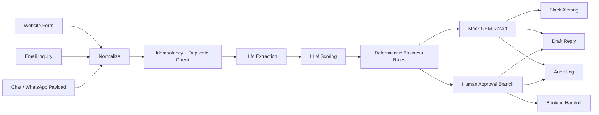
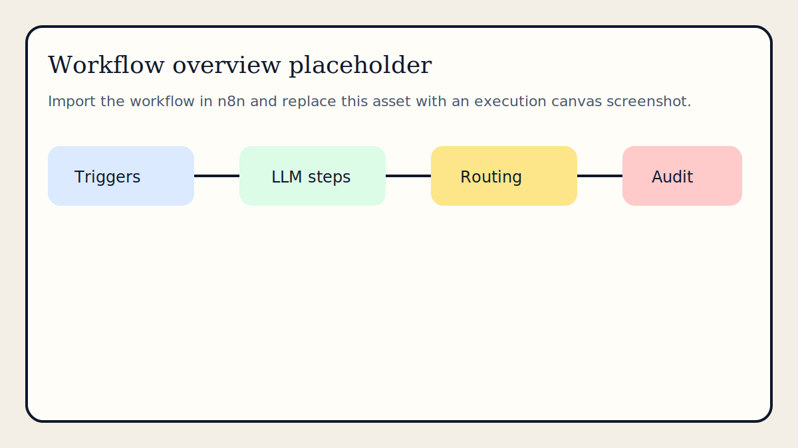
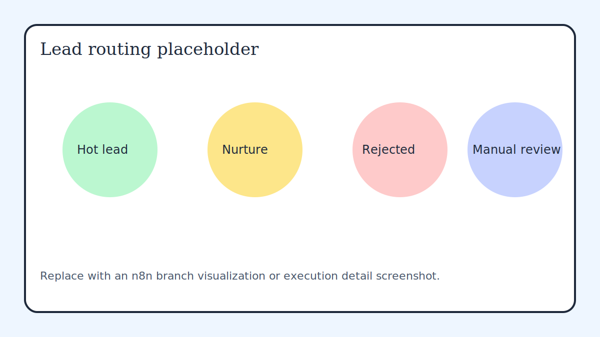
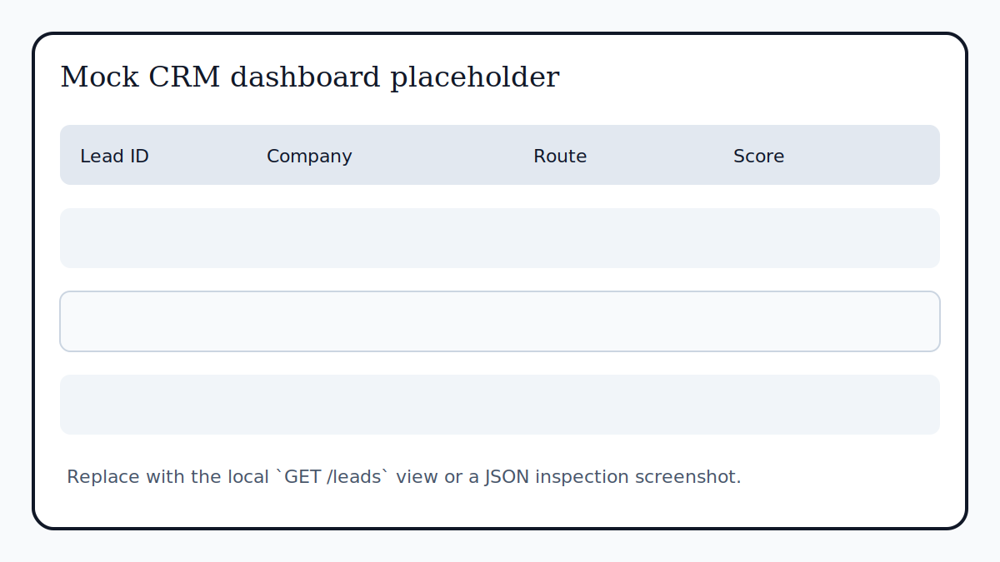

# n8n-ai-lead-ops-demo

> Sanitized client-style automation sample for AI-assisted lead intake, qualification, routing, CRM sync, notifications, approval gating, and audit logging.


## Overview

This repository is built to look like a generalized handoff from a freelance automation engagement. It demonstrates how inbound leads can be captured from multiple channels, normalized into a common schema, scored with an OpenAI-compatible abstraction, routed through deterministic business logic, synced into a CRM, surfaced to Slack, logged for auditability, and gated by human approval before outbound action.

The implementation is intentionally sanitized. Real customer identifiers, connector bindings, company-specific rules, secrets, and production credentials are not present.

## Use case

The sample fits agencies, consultancies, clinics, service operators, and B2B teams that need a practical lead-ops workflow with:

- multi-source intake
- AI-assisted qualification
- duplicate detection
- score-based routing
- CRM synchronization
- internal notifications
- draft response generation
- approval-gated handoff

## What this demo includes

- self-hosted `n8n` runtime via Docker Compose
- TypeScript mock backend for CRM, approvals, LLM abstraction, notifications, and audit storage
- exported n8n workflow with intake, scoring, routing, logging, and approval callback handling
- file-backed mock integrations so the demo still works without external credentials
- realistic payloads and response snapshots for portfolio review and proposal reuse

## Architecture



Detailed flow notes are in [docs/architecture.md](docs/architecture.md).

## Repository contents

| Path | Purpose |
| --- | --- |
| `n8n/workflows/lead-intake-ops.workflow.json` | Main orchestration workflow export |
| `mock-api/src/server.ts` | Mock CRM API and integration adapter service |
| `src/` | Shared domain models, services, adapters, and utilities |
| `scripts/send-sample.ts` | Replay a sample payload into n8n |
| `docs/sample-payloads/` | Realistic inbound scenario payloads |
| `test-data/demo-responses/` | Demo-friendly response snapshots |
| `data/` | File-backed storage for local demo runs |

## Running locally

1. Copy `.env.example` to `.env`.
2. Keep `OPENAI_MODE=mock` if you want the demo to run without a live LLM provider.
3. Run `npm install`.
4. Run `npm run seed`.
5. Run `docker compose up --build`.
6. Open n8n at `http://localhost:5678`.

The mock backend will be available at `http://localhost:3001`.

## Importing workflow into n8n

1. Open the n8n editor.
2. Import `n8n/workflows/lead-intake-ops.workflow.json`.
3. Activate the workflow.
4. Confirm the webhook paths:
   - `/webhook/lead-intake-website`
   - `/webhook/lead-intake-email`
   - `/webhook/lead-intake-chat`
   - `/webhook/lead-approval-decision`

## Environment configuration

Core variables:

| Variable | Purpose |
| --- | --- |
| `N8N_HOST` | n8n host binding |
| `WEBHOOK_BASE_URL` | public or local base URL for webhook callbacks |
| `OPENAI_API_KEY` | optional live API key |
| `OPENAI_MODEL` | live model name when not in mock mode |
| `MOCK_CRM_BASE_URL` | base URL for the local backend |
| `SLACK_WEBHOOK_URL` | optional live Slack webhook |
| `GMAIL_MODE` | local draft mode toggle |
| `AUDIT_MODE` | file-backed audit mode |

Useful extensions:

- `OPENAI_BASE_URL`
- `OPENAI_MODE`
- `SLACK_MODE`
- `HUMAN_APPROVAL_MODE`
- `APPROVAL_CALLBACK_URL`
- `BUDGET_MIN_QUALIFIED`

## Example lead scenarios

- `high-intent-b2b-website.json`: qualified B2B lead with budget, urgency, and clear purchase intent
- `low-budget-low-fit-email.json`: low-fit inquiry routed into nurture
- `duplicate-chat-lead.json`: repeat contact that should hit duplicate handling
- `ambiguous-manual-review-email.json`: unclear fit routed into manual review
- `spam-website-lead.json`: junk lead filtered before outbound actions

Replay example:

```bash
npm run simulate -- high-intent-b2b-website
```

Expected result snapshots live in `test-data/demo-responses/`.

## Notes on sanitization

This repository is a generalized reconstruction of a client-style workflow with all sensitive details removed. Secrets are stripped, company-specific rules are normalized into generic business logic, and connector bindings are replaced with mock or local development equivalents where appropriate.

## Limitations

- live SaaS connectors are intentionally replaced with local adapters by default
- the mock CRM is file-backed, not database-backed
- approval handling is webhook-based rather than backed by a separate UI
- no tenant isolation or auth layer is included because this sample is meant for local demonstration

## Extension ideas

- replace the file-backed CRM with HubSpot, Salesforce, Pipedrive, or a private API
- swap audit output into Sheets, Postgres, BigQuery, or S3
- connect booking handoff to Google Calendar or Calendly
- add enrichment, geocoding, and firmographic checks
- split approval resolution into a separate operator dashboard

## Screenshots

Placeholder assets are included so the repository is presentation-ready before final captures are taken.




